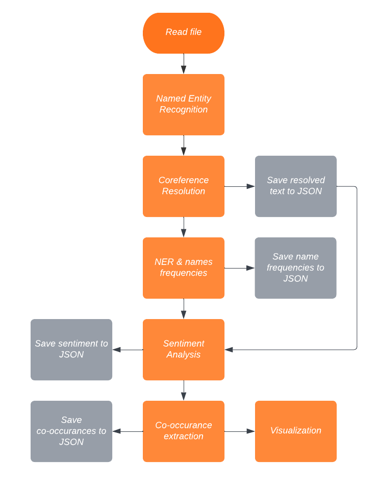

# Natural language processing course 2022/23: `Literacy situation models knowledge base creation`

Team members:
 * `Aljaž Sebastjan Ahtik`, `63180041`, `aa1353@student.uni-lj.si`
 * `Jaša Kerec`, `63190138`, `jk1919@student.uni-lj.si`
 * `Luka Kuzman`, `63170014`, `lk0098@student.uni-lj.si`
 
Group public acronym/name: `Avtoboti`

Report (PDF) is available [here](report/report.pdf)

## Installation

Install all the packages with pip.
```
cd src
pip install -r requirements.txt
```

## Datasets
Our datasets are placed inside folder ```/data```. We have three different corpuses. English short stories (```/data/english_short_stories```), Slovenian short stories (```/data/slovenian_short_stories```), and Slovenian novels (```/data/slovenian_novels```). Inside ```/data``` folder we also have JSON files which contain named entities by stories, character frequencies by stories and resolved texts by stories.

## Usage
The project is organized in a way, that you can always skip any step because all the results are stored in JSON files. This is great since some methods take really long time.



## NER and Coreference (English)

Open ```/src/sentiment_analysis_eng.ipynb``` and run all the cells. In the end, the results are stored in JSON files.

## NER and Coreference (Slovene)

Open ```/src/sentiment_analysis_slo_coref.ipynb``` and run all the cells. In the end, the results are stored in JSON files.

## Sentiment Analysis

```
cd src/sentex
python run.py <stories> <mode>
```
There are three possible *stories* values:
- ess: english short stories
- sss: slovenian short stories
- ssn: slovenian novels

There are three possible *mode* values (approaches):
- afinn
- vader
- bert

In the end again, the results are stored in JSON files.

## Co-occurance Extraction

```
cd src/cooccurrence
python run.py <stories> <mode>
```

The meaning of attributes is the same as in Sentiment Analysis.

## Visualization

```
cd src/cooccurrence
python run_visualize.py <story> <mode>
```

The *mode* is the same as in previous examples. And the *story* refers to a filename of the story file which you want to visualize (e.g. Henry_Red_Chief.txt).

